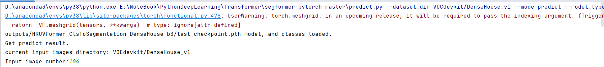
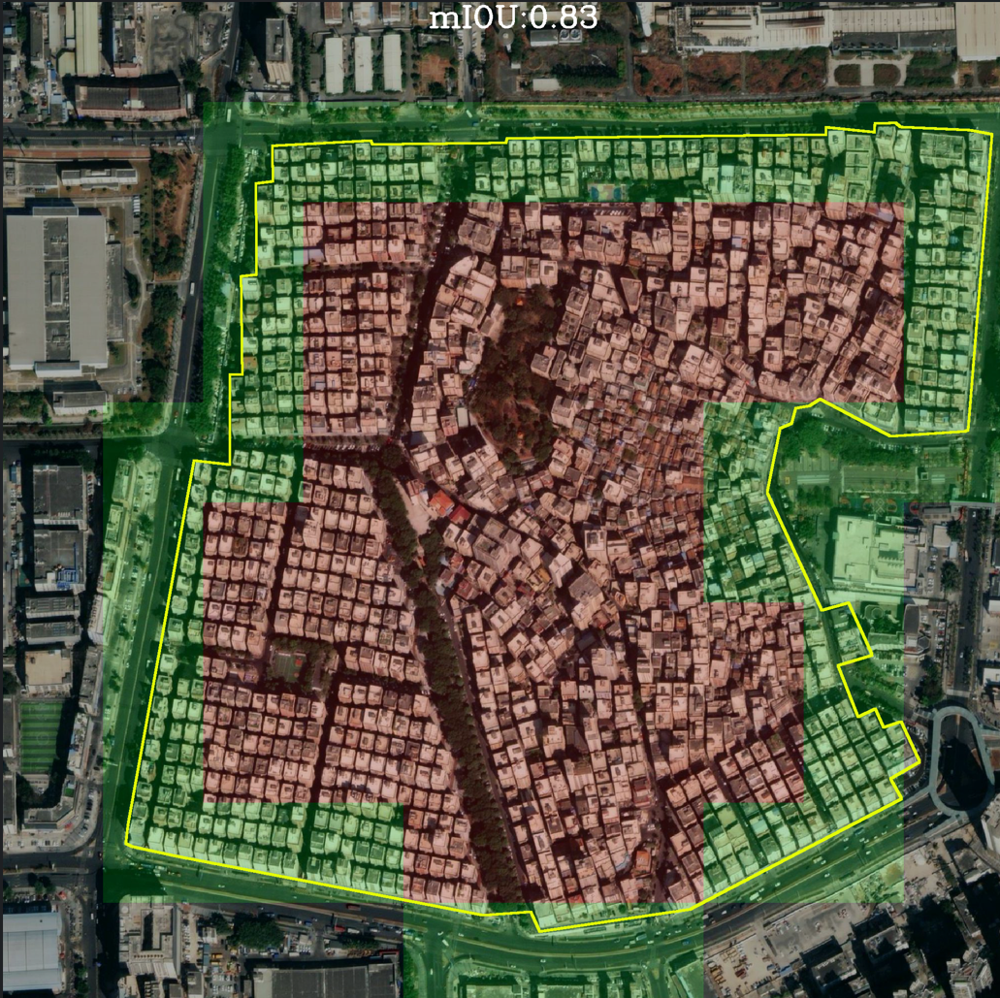
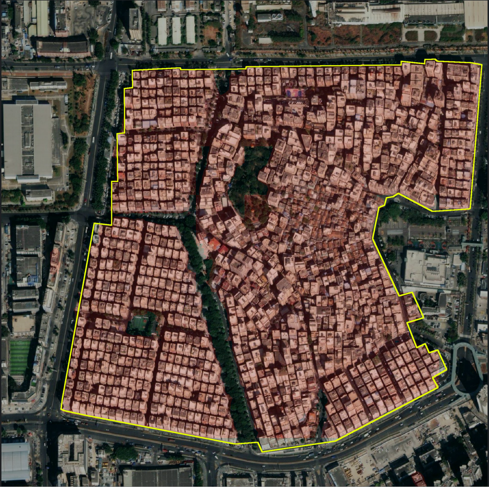

## HR-UVFormer Research Code Help
---

### Catalog
1. [Introduction](#仓库更新)
2. [File Directory](#相关仓库)
3. [ Performance](#性能情况)
4. [Necessary Environments](#所需环境)
5. [Download](#文件下载)
6. [How2train](#训练步骤)
7. [How2evaluate](#预测步骤)
8. [How2predict](#评估步骤)


## Introduction
**`2023-07`**:**HR-UVFormer, a top-down and multimodal hierarchical extraction framework, which performs top-down extraction of urban villages (UVs) from coarse scale (patches) to fine granularity (pixels). The framework integrates the strengths of multi-scale extraction and can fuse multimodal features, including building footprints (BF) and POI, aiming to enhance the internal completeness and boundary accuracy of the extraction results.**  

## File Directory
| Filename   | Brief |
|:-----------| :----- |
 train.py       | The model training and evaluation startup file, and configuration about the model  
 predict.py     | Visualization of predicted results
 segformer.py | Configuring the model for the prediction case
 nets/*.py  | The network structure files used in this study
 utils/callbacks.py | Callback functions called after certain training Epoches, including recording and calculating the associated precision
 utils/dataloader.py | Classes exist for loading two-level sample datasets
 utils/get_metrics.py | used to start accuracy evaluation
 **utils/utils_fit.py** | Functions to be called when training an Epoch 
 utils/utils_metrics.py | exist in the files to calculate metrics such as OA mIOU

### Performance
|      Model      |    Training data    |   Extraction Strategy    |   OA   |  mIOU  | Params |
|:---------------:|:-------------------:|:------------------------:|:------:|:------:|:------:| 
|    Segformer    |   Patch-level RSI   |       Pixel-based        |   /    | 85.81% | 47.20M |
|    Segformer    |   Patch-level RSI   | Hierarchical extraction  | 83.92% | 85.78% | 47.20M |
|    MLP-Mixer    |  Sample-level RSI   | Hierarchical extraction  | 94.45% | 92.03% | 60.11M |
| SwinTransformer |  Sample-level RSI   | Hierarchical extraction  | 95.41% | 92.91% | 61.41M |
| SlWinSegformer  |  Sample-level RSI   | Hierarchical extraction  | 96.01% | 92.95% | 61.45M |
|   HR-UVFormer   | Sample-level RSI+BF | Hierarchical extraction  | 98.79% | 93.60% | 91.19M |

### Necessary Environments
torch==1.12.0   
tensorboard==2.12.0     
GDAL==3.4.3     
tqdm==4.64.1    
einops==0.6.0   
numpy~=1.23.5   
timm~=0.6.12    
einops~=0.6.0   
pillow~=9.3.0   
torchvision~=0.13.0     
matplotlib~=3.1.2   
scipy~=1.9.1    
pandas~=1.5.3   
opencv-python~=4.7.0.72     
tqdm~=4.64.1    


### Download link
Pre-trained model weights files     
Link: https://pan.baidu.com/s/1tH4wdGnACtIuGOoXb0_rAw     

Dataset：   
Link: https://pan.baidu.com/s/1vkk3lMheUm6IjTXznlg7Ng     

### How2train
#### Segformer 
1. Place the downloaded dataset *DenseHouse_v2* in the VOCdevkit directory
2. Place the downloaded weights *segformer_b3_backbone_weights.pth* in the model_data directory
3. Configure the following parameters in train.py or enter the command line directly in the terminal

Command Lines:  
```commandline
--name
Segformer_ClsToSegmentation_DenseHouse
--model_type
Segformer
--local_rank
0
--fp16
--dataset_dir
VOCdevkit
--dataset
DenseHouse_v2
--train_batch_size
24
--train_freeze_batch_size
30
--freeze_epoch
20
--num_epoch
80
--backbone_type
b3
--output_type
cls_to_seg
--num_classes_cls
3
--num_classes_seg
2
--pretrained_filename
model_data/segformer_b3_backbone_weights.pth
--pretrained_backbone
--dataset_type
RS
--input_shape
200
--evaluate_type
cls_to_seg
--name_classes_file
VOCdevkit/DenseHouse_v2/ImageSets/name_classes_segmentation.txt
```

#### SlWinSegformer / MLP-Mixer / SwinTransforemr
1. Place the downloaded dataset *DenseHouse_v1* in the *VOCdevkit* directory
2. Place the pretrained *Segfromer* .pth file in the *outputs* directory
3. Configure the following parameters in train.py or enter the command line directly in the terminal

```commandline
--name
SlWin_ClsToSegmentation_DenseHouse
--model_type
SlWinSegformer
--focal_loss
--local_rank
0
--fp16
--dataset_dir
VOCdevkit
--dataset
DenseHouse_v1
--train_freeze_batch_size
1
--freeze_epoch
30
--num_epoch
30
--backbone_type
b3
--output_type
segmentation
--num_classes_cls
3
--num_classes_seg
3
--pretrained_filename
outputs/Segformer_UV_ClsToSegmentation_DenseHouse_b3/last_checkpoint.pth
--pretrained_backbone
--dataset_type
RS
--input_shape
2000
--evaluate_type
cls_to_seg
--name_classes_file
VOCdevkit/DenseHouse_v2/ImageSets/name_classes_segmentation.txt
```
The options for *--model_type* contatin:
```commandline
SlWinSegformer/MixerSegformer/SwinSegformer
```

#### HR-UVForemr
1. Place the downloaded dataset *DenseHouse_v1* in the *VOCdevkit* directory
2. Place the pretrained *Segfromer* .pth file in the *outputs* directory
3. Place the downloaded weights *segformer_b0_backbone_weights.pth* in the model_data directory
4. Configure the following parameters in train.py or enter the command line directly in the terminal

```commandline
--name
HRUVFormer_ClsToSegmentation_DenseHouse
--model_type
HR_UVFormer
--focal_loss
--local_rank
0
--fp16
--dataset_dir
VOCdevkit
--dataset
DenseHouse_v1
--train_freeze_batch_size
1
--freeze_epoch
50
--num_epoch
50
--backbone_type
b3
--output_type
segmentation
--num_classes_cls
3
--num_classes_seg
3
--pretrained_filename
outputs/Segformer_UV_ClsToSegmentation_DenseHouse_b3/last_checkpoint.pth
--pretrained_backbone
--dataset_type
RSB
--input_shape
2000
--evaluate_type
cls_to_seg
--name_classes_file
VOCdevkit/DenseHouse_v2/ImageSets/name_classes_segmentation.txt
```
  

### How2evaluate
#### Segformer
1. Place the downloaded dataset *DenseHouse_v2* in the *VOCdevkit* directory
2. Place the trained *Segfromer* .pth file in the *outputs* directory
3. Configure the following parameters in train.py or enter the command line directly in the terminal

```commandline
--name
Segformer_ClsToSegmentation_DenseHouse
--model_type
Segformer
--local_rank
0
--dataset_dir
VOCdevkit
--dataset
DenseHouse_v2
--backbone_type
b3
--output_type
cls_to_seg
--num_classes_cls
3
--num_classes_seg
2
--pretrained_filename
outputs/Segformer_UV_ClsToSegmentation_DenseHouse_b3/last_checkpoint.pth
--only_evaluate
--dataset_type
RS
--input_shape
200
--evaluate_type
cls_to_seg
--name_classes_file
VOCdevkit/DenseHouse_v2/ImageSets/name_classes_segmentation.txt
```

The options for *--evaluate_type* contatin:
```commandline
Hierarchical extraction-mIoU:
--evaluate_type
cls_to_seg

Pixel-based-mIoU:
--evaluate_type
segmentation

Hierarchical extraction-OA:
--evaluate_type
classification
```

#### SlWinSegformer / MLP-Mixer / SwinTransforemr
1. Place the downloaded dataset *DenseHouse_v1* in the *VOCdevkit* directory
2. Place the trained *SlWinSegformer / MLP-Mixer / SwinTransforemr* .pth file in the *outputs* directory
3. Configure the following parameters in train.py or enter the command line directly in the terminal

```commandline
--name
SlWin_ClsToSegmentation_DenseHouse
--model_type
SlWinSegformer
--local_rank
0
--dataset_dir
VOCdevkit
--dataset
DenseHouse_v1
--backbone_type
b3
--output_type
segmentation
--num_classes_cls
3
--num_classes_seg
3
--pretrained_filename
outputs/SlWin3_ClsToSegmentation_DenseHouse_b3/last_checkpoint.pth
--only_evaluate
--dataset_type
RS
--input_shape
2000
--evaluate_type
segmentation
--name_classes_file
VOCdevkit/DenseHouse_v2/ImageSets/name_classes_classification.txt
```

The options for *--evaluate_type*, *--num_classes_seg*, *--name_classes_file* contatin:
```commandline
Hierarchical extraction-OA:
--num_classes_seg
3
--evaluate_type
segmentation
--name_classes_file
VOCdevkit/DenseHouse_v2/ImageSets/name_classes_classification.txt

Hierarchical extraction-mIoU:
--num_classes_seg
2
--evaluate_type
cls_to_seg
--name_classes_file
VOCdevkit/DenseHouse_v2/ImageSets/name_classes_segmentation.txt
```

#### HR-UVFormer
1. Place the downloaded dataset *DenseHouse_v1* in the *VOCdevkit* directory
2. Place the trained *HR_UVFormer* .pth file in the *outputs* directory
3. Configure the following parameters in train.py or enter the command line directly in the terminal

```commandline
--name
HRUVForemr_ClsToSegmentation_DenseHouse
--model_type
HR_UVFormer
--local_rank
0
--dataset_dir
VOCdevkit
--dataset
DenseHouse_v1
--backbone_type
b3
--output_type
segmentation
--num_classes_cls
3
--num_classes_seg
3
--pretrained_filename
outputs/HRUVFormer_ClsToSegmentation_DenseHouse_b3/last_checkpoint.pth
--only_evaluate
--dataset_type
RSB
--input_shape
2000
--evaluate_type
segmentation
--name_classes_file
VOCdevkit/DenseHouse_v2/ImageSets/name_classes_classification.txt
```

The options for *--dataset_type* contatin:
```commandline
BF+RSI:
--dataset_type
RSB

POI+RSI:
--dataset_type
RSP

RSI:
--dataset_type
RS
```


### How2predict

#### HR-UVFormer/SlWinSegformer / MLP-Mixer / SwinTransforemr
1. Place the downloaded dataset *DenseHouse_v1* in the *VOCdevkit* directory
2. Place the trained *HR_UVFormer* .pth file in the *outputs* directory
3. Configure the following parameters in **predict.py** or enter the command line directly in the terminal

```commandline
--dataset_dir
VOCdevkit/DenseHouse_v1
--mode
predict
--model_type
HR_UVFormer
--backbone_type
b3
--output_type
segmentation
--pretrained_filename
outputs/HRUVFormer_ClsToSegmentation_DenseHouse_b3/last_checkpoint.pth
--input_shape
2000
--local_rank
0
--num_classes_seg
3
--dataset_type
RSB
--evaluate_type
cls_replace_seg
--name_classes_file
VOCdevkit/DenseHouse_v2/ImageSets/name_classes_classification.txt
--save_dir
miou_out/detection-results

```

**Note：--pretrained_filename** and **--model_type** need to maintain correspondence

The options for *--mode* contatin:
```commandline
Predict and visualize a sample:
--mode
predict

Model Inference a Region
--mode
interpret
```

The options has some differences in two extraction scales:
```commandline
Coarse-scale extraction results:
--num_classes_seg
3
--evaluate_type
cls_replace_seg
--name_classes_file
VOCdevkit/DenseHouse_v2/ImageSets/name_classes_classification.txt

Fine-grained extraction results:
--num_classes_seg
2
--evaluate_type
cls_to_seg
--name_classes_file
VOCdevkit/DenseHouse_v2/ImageSets/name_classes_segmentation.txt
```

**Note**: SlWinSegformer / MLP-Mixer / SwinTransforemr only supports the option --dataset_type:
```commandline
--dataset_type
RSI
```


An example: coarse scale extraction result of 104.jpg based on HR-UVFormer
```commandline
predict.py --dataset_dir VOCdevkit/DenseHouse_v1 --mode predict --model_type HR_UVFormer --backbone_type b3 --output_type segmentation --pretrained_filename outputs/HRUVFormer_ClsToSegmentation_DenseHouse_b3/last_checkpoint.pth --input_shape 2000 --local_rank 0 --num_classes_seg 3 --dataset_type RSB --evaluate_type cls_replace_seg --name_classes_file VOCdevkit/DenseHouse_v2/ImageSets/name_classes_classification.txt --save_dir miou_out/detection-results
```





#### Segformer
1. Place the downloaded dataset *DenseHouse_v2* in the *VOCdevkit* directory
2. Place the trained *Segformer* .pth file in the *outputs* directory
3. Configure the following parameters in **predict.py** or enter the command line directly in the terminal

```commandline
--dataset_dir
VOCdevkit/DenseHouse_v2
--mode
predict
--model_type
Segformer
--backbone_type
b3
--output_type
cls_to_seg
--pretrained_filename
outputs/Segformer_UV_ClsToSegmentation_DenseHouse_b3/ep080-loss0.068-val_loss0.587.pth
--input_shape
200
--local_rank
0
--num_classes_seg
2
--dataset_type
RS
--evaluate_type
cls_to_seg
--name_classes_file
VOCdevkit/DenseHouse_v2/ImageSets/name_classes_segmentation.txt
--save_dir
miou_out/detection-results
```

The options has some differences in the two extraction strategies:
```commandline

Coarse-scale extraction results:
--num_classes_seg
3
--evaluate_type
cls_replace_seg
--name_classes_file
VOCdevkit/DenseHouse_v2/ImageSets/name_classes_classification.txt

Fine-grained extraction results:
--num_classes_seg
2
--evaluate_type
cls_to_seg
--name_classes_file
VOCdevkit/DenseHouse_v2/ImageSets/name_classes_segmentation.txt

Pixle-based extraction results:
--num_classes_seg
2
--evaluate_type
segmentation
--name_classes_file
VOCdevkit/DenseHouse_v2/ImageSets/name_classes_segmentation.txt
```

An example: fine-grained extraction result of 104.jpg based on Segformer:
```commandline
predict.py --dataset_dir VOCdevkit/DenseHouse_v2 --mode predict --model_type Segformer --backbone_type b3 --output_type cls_to_seg --pretrained_filename outputs/Segformer_UV_ClsToSegmentation_DenseHouse_b3/ep080-loss0.068-val_loss0.587.pth --input_shape 200 --local_rank 0 --num_classes_seg 2 --dataset_type RS --evaluate_type cls_to_seg --name_classes_file VOCdevkit/DenseHouse_v2/ImageSets/name_classes_segmentation.txt --save_dir miou_out/detection-results 
```
